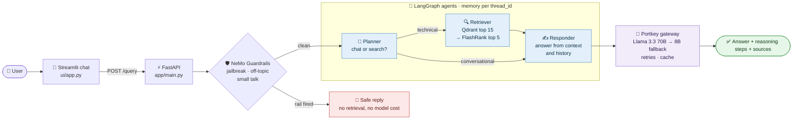
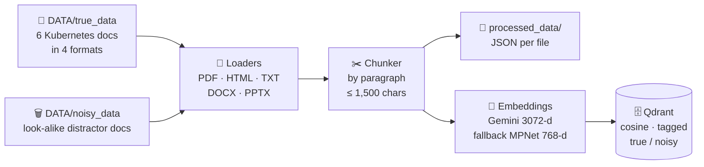
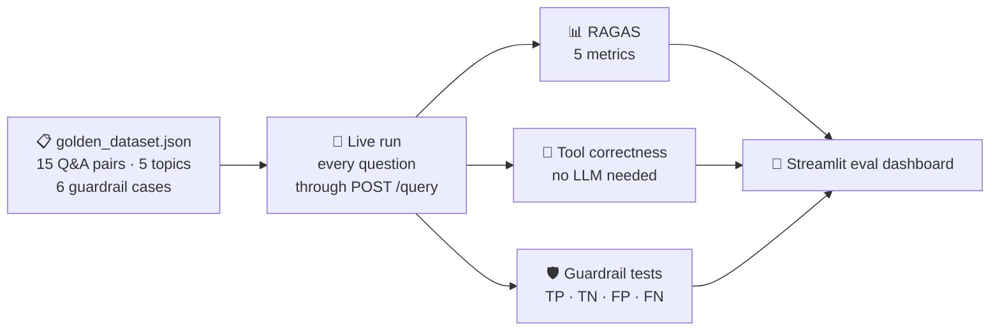

<div align="center">

# 🤖 Production Multi-Agentic RAG System

### An enterprise IT assistant that is guarded, plans before it searches, and is measured

**Ask about Kubernetes, Intel hardware or networking. Get an answer built from your own documents, with the sources and the agent's reasoning steps.**

[](https://www.python.org/)
[](https://fastapi.tiangolo.com/)
[](https://github.com/langchain-ai/langgraph)
[](https://github.com/NVIDIA/NeMo-Guardrails)
[](https://qdrant.tech/)
[](https://portkey.ai/)
[](https://docs.ragas.io/)
[](https://pydantic.dev/logfire)
[](https://streamlit.io/)
[](LICENSE)

[How it works](#-how-it-works) · [Quick start](#-quick-start) · [Evaluation](#-evaluation) · [API](#-api) · [Roadmap](#-roadmap)

</div>

---

Most RAG demos are one prompt and one vector search. This system is built the way a production assistant must be. Every question passes a **safety gate** first. Then a **planner agent** decides whether a search is needed at all. A **retriever agent** searches in two stages, and a **responder agent** writes the answer through a **model gateway** that retries and falls back on its own. Every step is **traced**, and the whole pipeline is **scored** against a golden dataset.

## ✨ Highlights

| 🛡️ Guarded at the door | 🧭 Plans before it searches | 🎯 Two-stage retrieval |
|---|---|---|
| NVIDIA **NeMo Guardrails** with Colang rules blocks jailbreaks and off-topic requests, and handles small talk, *before* any retrieval or model cost. | A **planner agent** reads the whole conversation and decides: answer from memory, or rewrite the question into a better search query. Memory is kept per `thread_id`. | **Qdrant** dense search brings back 15 candidates. A local **FlashRank** cross-encoder re-scores them and keeps the best 5. If the reranker fails, the Qdrant order is used, so the user still gets an answer. |

| 🔀 A gateway that does not give up | 📈 Observable end to end | 🧪 Measured, not guessed |
|---|---|---|
| **Portkey** routes the planner and responder calls to Llama 3.3 70B on Groq, retries on `429`/`503`, falls back to Llama 3.1 8B and caches answers. A cache hit is shown in the reasoning steps. | **Logfire** is set up before any other import, so every guardrail check, planner decision, search, rerank and model call is one span in a trace. LangSmith tracing is on by default too. | A **Streamlit eval dashboard** runs the golden dataset through the live API and scores it with **RAGAS**, tool correctness and a guardrail confusion matrix. |

## 🧭 How it works



<sub>📈 Logfire traces every box above. The planner also calls the model through the Portkey gateway. `GET /graph` returns a live picture of the LangGraph.</sub>

**One question, step by step:**

1. **Guard.** NeMo Guardrails checks the message. If a rail fires (a jailbreak, an off-topic request, a greeting), the API returns the rail's reply at once, and retrieval is skipped.
2. **Plan.** The planner reads the conversation history. A greeting, or a question the history can answer ("what is my name?"), goes straight to the responder. A technical question is rewritten into a sharper search query.
3. **Retrieve.** The query is embedded and sent to Qdrant (top 15). FlashRank re-scores the candidates with a cross-encoder and keeps the top 5.
4. **Respond.** The responder builds the prompt from the retrieved context (capped at 25,000 characters, to stay inside Groq's token limits) and the history. It calls the model through Portkey at temperature 0.1.
5. **Return.** The API sends back the answer, the reasoning steps (`thought_process`), the status and the source chunks. The chat UI shows all of them.

## 📥 Ingestion



- **Real documents and deliberate noise.** `DATA/true_data` holds the Kubernetes material (architecture, CronJobs, jobs, monitoring, work queues, pod autoscaling) as PPTX, DOCX, HTML and TXT. `DATA/noisy_data` holds distractor files with real-sounding titles and random content. They test that retrieval finds the right chunk inside a noisy index.
- **Robust parsing.** PDFs are read with pypdf, and any page that comes back blank is retried with pdfplumber.
- **Embeddings that do not block.** At start-up a probe call checks Gemini (`gemini-embedding-2-preview`, 3072 dimensions). If Gemini is not reachable, the system switches to a local `all-mpnet-base-v2` model (768 dimensions) and sizes the Qdrant collection to match. Batches of 50 retry with exponential backoff (1 → 2 → 4 → 8 s) on rate limits.
- **Every chunk is tagged** with its source file and source type, so noise can be told apart from the real documents.

```bash
python -m app.ingestion.processor DATA --wipe          # drop and rebuild the collection, then index everything
python -m app.ingestion.processor DATA/true_data true  # index one folder with an explicit source type
```

## 🧪 Evaluation



The eval suite (`streamlit run evals/app.py`) runs in three tabs: **the ground truth**, **the live pipeline** and **the metrics**. It calls the real running API, so it measures the system a user actually talks to.

| Metric | The question it answers | How it is scored |
|---|---|---|
| Faithfulness | Is every claim in the answer supported by the retrieved context? | RAGAS, LLM judge |
| Answer relevancy | Does the answer address the question that was asked? | RAGAS, LLM judge + embeddings |
| Context precision | Are the retrieved chunks the relevant ones, ranked high? | RAGAS, against the reference answer |
| Context recall | Did retrieval find everything the reference answer needs? | RAGAS, against the reference answer |
| Answer correctness | Does the answer match the reference answer? | RAGAS, LLM judge + embeddings |
| Tool correctness | Did the agent take the expected path (retrieve, answer directly, or block)? | Jaccard overlap, no LLM |
| Guardrail accuracy | Are attacks blocked and real questions let through? | Precision, recall and accuracy over TP / TN / FP / FN |

<details>
<summary><b>How the evals stay inside free-tier limits</b></summary>

- The judge is `llama-3.1-8b-instant` on Groq, through its **own key** (`JUDGE_GROQ`), so an eval run never uses up the production key.
- RAGAS embeddings run locally (`all-MiniLM-L6-v2`).
- Samples are scored one at a time, with 40 s cooldowns between samples and 62 s between metrics, calibrated for Groq's 6,000 tokens-per-minute tier. Contexts are cut to 2 chunks of 300 characters for the judge. A full run takes about 50 minutes.

</details>

## 🚀 Quick start

```bash
git clone https://github.com/nishantrv/Production-Multi-Agentic-RAG-System-.git
cd Production-Multi-Agentic-RAG-System-
python -m venv .venv && source .venv/bin/activate      # Windows: .venv\Scripts\activate
pip install -r requirements.txt

python -m app.ingestion.processor DATA --wipe          # 1. index the documents into Qdrant
uvicorn app.main:app --reload --port 8000              # 2. start the API  (docs at http://localhost:8000/docs)
streamlit run ui/app.py                                # 3. chat with the assistant (new terminal)
streamlit run evals/app.py                             # 4. run the evaluation dashboard (API must be running)
```

<details>
<summary><b>Settings (<code>.env</code> in the project root)</b></summary>

| Variable | Used for |
|---|---|
| `GROQ_API_KEY` | the guardrails model (Llama 3.3 70B) |
| `PORTKEY_API_KEY` | the model gateway for the planner and the responder |
| `GEMINI_API_KEY` | Gemini embeddings (optional; a local model is used without it) |
| `QDRANT_CLUSTER_ENDPOINT`, `QDRANT_API_KEY` | the Qdrant vector database |
| `LOGFIRE_TOKEN` | Logfire tracing |
| `LANGSMITH_API_KEY`, `LANGSMITH_PROJECT`, `LANGSMITH_TRACING`, `LANGSMITH_ENDPOINT` | LangSmith tracing (optional) |
| `JUDGE_GROQ` | a separate Groq key for the eval judge (falls back to `GROQ_API_KEY`) |
| `BACKEND_URL` | where the chat UI finds the API (default `http://localhost:8000`) |

**Portkey:** create two Groq integrations in the Portkey model catalog, with the slugs `rag` (primary, `llama-3.3-70b-versatile`) and `brag` (fallback, `llama-3.1-8b-instant`). The routing, retry and cache rules are in `app/gateway/client.py`.

</details>

## 🔌 API

| Method | Path | What it does |
|---|---|---|
| `GET` | `/` | health check |
| `GET` | `/graph` | a PNG picture of the LangGraph agent workflow |
| `POST` | `/query` | ask a question: `{"q": "...", "thread_id": "..."}` |

```bash
curl -X POST http://localhost:8000/query \
  -H "Content-Type: application/json" \
  -d '{"q": "How do I run a CronJob every five minutes?", "thread_id": "demo"}'
```

```json
{
  "question": "How do I run a CronJob every five minutes?",
  "answer": "...",
  "thought_process": ["Intent: Technical", "Search Term: ...", "Context Retrieved"],
  "status": "Response generated.",
  "sources": ["CONTENT: ...", "CONTENT: ..."]
}
```

Use the same `thread_id` again and the agent remembers the conversation.

## 🧰 Tech stack

| | Tool | Why it is here |
|---|---|---|
| ⚡ API | **FastAPI** + Uvicorn | typed request models, and interactive docs for free |
| 🧠 Agents | **LangGraph** | a state graph with a conditional route (planner → retriever or responder) and a checkpointer for memory per thread |
| 🛡️ Safety | **NVIDIA NeMo Guardrails** | Colang rules for jailbreaks, off-topic requests and small talk, checked before any retrieval |
| 🔀 Gateway | **Portkey** | fallback, retries, caching and request metadata, all as configuration |
| 🦙 Models | **Llama 3.3 70B / 3.1 8B on Groq** | fast inference, with a smaller model as the fallback |
| 🗄️ Search | **Qdrant** + **FlashRank** | dense search, then a local ONNX cross-encoder reranker |
| 🧬 Embeddings | **Gemini** + **sentence-transformers** | a strong hosted model, with a local fallback |
| 📄 Parsing | pypdf, pdfplumber, BeautifulSoup, python-docx, python-pptx | one loader per format |
| 📈 Tracing | **Logfire** + **LangSmith** | a span for every step, from the UI click to the model call |
| 🧪 Evals | **RAGAS** + Streamlit | standard RAG metrics, run against the live API |

## 🗂️ Project layout

```
app/
├── main.py                 FastAPI: /, /graph, /query, guardrails gate
├── config.py               settings from .env
├── agents/
│   ├── graph.py            the LangGraph workflow and its memory
│   ├── state.py            the shared agent state
│   └── nodes/              planner.py · retriever.py · responder.py
├── guradrails/             NeMo rails setup and Colang rules
├── gateway/client.py       Portkey fallback, retry and cache config
├── ingestion/              processor.py, loaders/ (pdf, html, text, office), chunking/
└── services/retrieval/     embedding.py · qdrant_service.py · ranking_service.py
ui/app.py                   Streamlit chat with reasoning steps and sources
evals/                      golden dataset, live pipeline, RAGAS metrics, guardrail tests, dashboard
DATA/                       true_data (Kubernetes docs) and noisy_data (distractors)
```

## 🛣️ Roadmap

- [ ] Keep conversation memory across restarts (a SQLite or Postgres checkpointer instead of the in-memory one)
- [ ] Hybrid search: BM25 keywords together with dense vectors, merged with rank fusion
- [ ] Make the guardrail gate fail closed if the rails did not start
- [ ] Unit tests and CI that run the golden dataset on every change
- [ ] A semantic cache (Portkey Enterprise) instead of the exact-match cache
- [ ] Return source file names with each chunk in the API response

## 📄 License

Apache 2.0. See [LICENSE](LICENSE).

<div align="center"><sub>Built to show what it takes to move a RAG demo to production: guard it, plan it, trace it and measure it.</sub></div>
